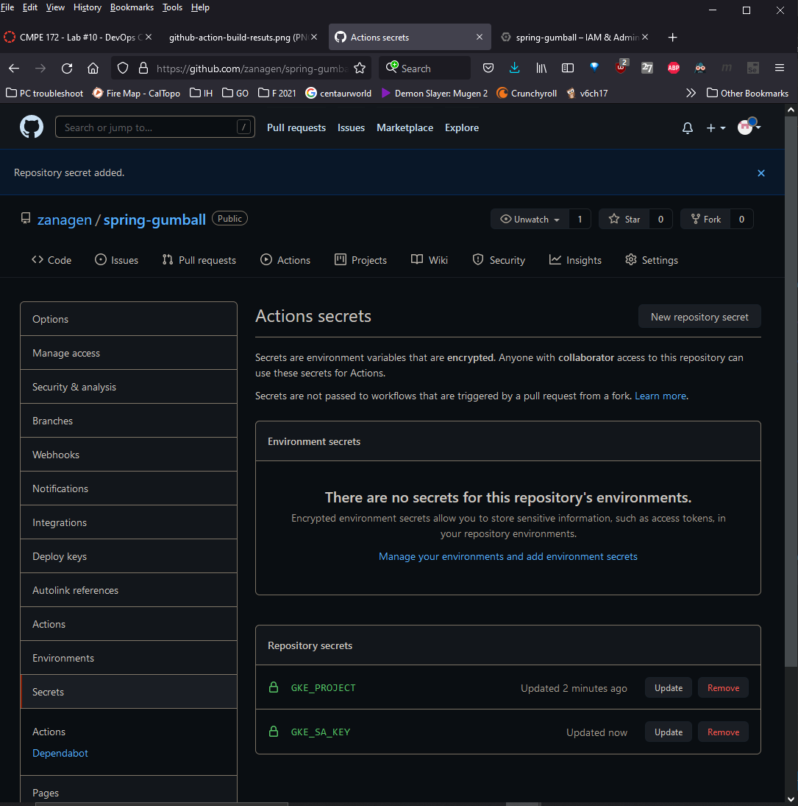

# CMPE 172 - Lab #10 Notes - Windows 10 Device

## Navigation
 - [Code Setup](##code-setup)
 - [CI Workflow (Part 1)](##ci-workflow-(part-1))
 - [CI Workflow (Part 2)](##ci-workflow-(part-2))
 - [Discussion]()
 <!-- - [x] test        - THIS ADDS A CHECK-MARKED CHECK BOX -->
 - [Discussion](##discussion)
 - *No fixed header-linking in README file, please use `Ctrl + F` to search.*

## Code Setup

1. In GitHub, log into your account and create a public repo named `spring-gumball`.

2. Clone the resources folder from [this repository](https://github.com/paulnguyen/cmpe172/tree/main/labs/lab10/starter-code/spring-gumball).

3. Push the folder to Github.

## CI Workflow (Part 1)

1. On the main page of the `spring-gumball` GitHub repo, navigate to the `Actions` tab. Scroll down and expand the page by clicking on `More continuous integration workflows...`. Select the option `Java with Gradle`. This generates a `gradle.yml`.

2. Replace the code with the following:

```yml
name: Java CI with Gradle

on:
  push:
    branches: [ main ]
  pull_request:
    branches: [ main ]

jobs:
  build:

    runs-on: ubuntu-latest

    steps:
    - uses: actions/checkout@v2
    - name: Set up JDK 11
      uses: actions/setup-java@v2
      with:
        java-version: '11'
        distribution: 'adopt'
    - name: Grant execute permission for gradlew
      run: chmod +x gradlew
    - name: Build with Gradle
      run: ./gradlew build
    - name: Build Result
      run: ls build/libs
    - name: Upload a Build Artifact
      uses: actions/upload-artifact@v2.2.3
      with:
        name: spring-gumball
        path: build/libs/spring-gumball-2.0.jar
```

3. Commit the new file to the main branch. This file will be created in the `spring-gumball/.github/workflows/` folder.

4. In Github, go to the Actions tab, click on the job, and run it.

The image below displays the result


5. Click on the `New workflow` button. Scroll down and expand the page by clicking on `More continuous integration workflows...`. Select the option `Build and Deploy to GKE`. This generates a `google.yml`.

6. Replace the code with the following:

```yml
name: Build and Deploy to GKE

on:
  release:
    types: [created]

env:
  PROJECT_ID: ${{ secrets.GKE_PROJECT }}
  GKE_CLUSTER: cluster-1    # TODO: update to cluster name
  GKE_ZONE: us-central1-c   # TODO: update to cluster zone
  DEPLOYMENT_NAME: spring-gumball # TODO: update to deployment name
  IMAGE: spring-gumball

jobs:
  setup-build-publish-deploy:
    name: Setup, Build, Publish, and Deploy
    runs-on: ubuntu-latest
    environment: production

    steps:
    - name: Checkout
      uses: actions/checkout@v2

    # Build JAR File
    - name: Set up JDK 11
      uses: actions/setup-java@v2
      with:
        java-version: '11'
        distribution: 'adopt'
    - name: Grant execute permission for gradlew
      run: chmod +x gradlew
    - name: Build with Gradle
      run: ./gradlew build
    - name: Build Result
      run: ls build/libs

    # Setup gcloud CLI
    - uses: google-github-actions/setup-gcloud@v0.2.0
      with:
        service_account_key: ${{ secrets.GKE_SA_KEY }}
        project_id: ${{ secrets.GKE_PROJECT }}

    # Configure Docker to use the gcloud command-line tool as a credential
    # helper for authentication
    - run: |-
        gcloud --quiet auth configure-docker

    # Get the GKE credentials so we can deploy to the cluster
    - uses: google-github-actions/get-gke-credentials@v0.2.1
      with:
        cluster_name: ${{ env.GKE_CLUSTER }}
        location: ${{ env.GKE_ZONE }}
        credentials: ${{ secrets.GKE_SA_KEY }}

    # Build the Docker image
    - name: Build
      run: |-
        docker build \
          --tag "gcr.io/$PROJECT_ID/$IMAGE:$GITHUB_SHA" \
          --build-arg GITHUB_SHA="$GITHUB_SHA" \
          --build-arg GITHUB_REF="$GITHUB_REF" \
          .

    # Push the Docker image to Google Container Registry
    - name: Publish
      run: |-
        docker push "gcr.io/$PROJECT_ID/$IMAGE:$GITHUB_SHA"

    # Set up kustomize
    - name: Set up Kustomize
      run: |-
        curl -sfLo kustomize https://github.com/kubernetes-sigs/kustomize/releases/download/v3.1.0/kustomize_3.1.0_linux_amd64
        chmod u+x ./kustomize

    # Deploy the Docker image to the GKE cluster
    - name: Deploy
      run: |-
        ./kustomize edit set image gcr.io/PROJECT_ID/IMAGE:TAG=gcr.io/$PROJECT_ID/$IMAGE:$GITHUB_SHA
        ./kustomize build . | kubectl apply -f -
        #kubectl rollout status deployment/$DEPLOYMENT_NAME
        #kubectl get services -o wide
```

7. Commit the new file to the main branch. This file will be created in the `spring-gumball/.github/workflows/` folder.

8. Navigate to the `Code` tab, and click on the `deployment.yaml` file. Change the number of replicas from `4` to `2` and commit changes.

9. Navigate to the `Actions` tab, and wait for the yellow indicator to turn `green`. If the indicator is `yellow`, this means the job is running, and if the indicator is `red`, then the job failed.

xx. In Github, go to the Actions tab, click on the job, and run it.

The image below displays the result


##  CI Workflow (Part 2)

1. In a browser, navigate to Google Cloud Platform. In the left panel, go to Kubernetes Engine > Clusters, and follow steps to create a new cluster:
 - Click on Create
 - Click on GKE Standard
 - Pick a name
 - Navigate to left panel default-pool > Nodes
 - Change machine type to small (2vCPU, 2GB RAM)
 - Click on Create

2. Expand the `Google Cloud Platform` hamburger panel, and navigate to IAM & Admin > Service Accounts > Create Service Account.

3. Input `spring-gumball` as the `Service account name`, and add to the service the following roles, then click on the `Done` button:

```
Owner
Kubernetes Engine Developer
Storage Admin
Service Account Admin
```

4. Click on the spring-gumball service link, go to the `Keys` tab, and click on Add Key > Create New Key. Ensure it is a JSON file, and save it to a known location.

5. In GitHub, go to Settings > Secrets, and click on `New Repository Secret`. Input the `Name` as `GKE_PROJECT`, and the `Value` is found in the JSON key file, under project_id (don't copy the quotation marks). Then click on the `Add Secret` button.

6. Click on `New Repository Secret` again. Input the `Name` as `GKE_SA_KEY`, and copy the entire contents of the JSON file into the `Value` textbox (including brackets). Then click on the `Add Secret` button.

The image below displays the secrets in GitHub



7. In GitHub, navigate to the `Code` tab, and select the `Create a new release` option. Click on `Create a new tag` and type in `2.4` as the value, then select `Create new tag: 2.4 on publish`. Add the title of the release as `2.4` as well. Then click on the `Publish release` button.

The image below displays the release


8. Navigate to the `Actions` tab and rerun the jobs in the `Build and Deploy to GKE` workflow. Then navigate to the Google Cloud Platform and check that the service and deployment pods are running.

## Discussion